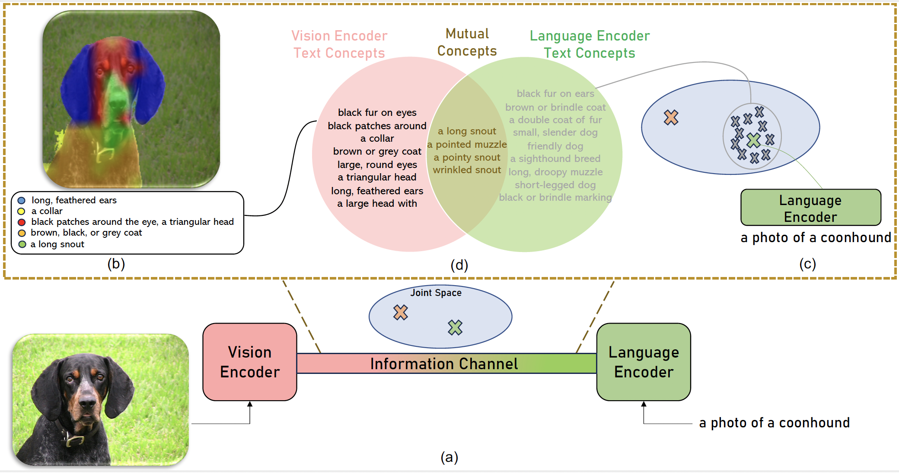

**Official code** for our paper: [Interpreting and Analyzing CLIP's Zero-Shot Image Classification via Mutual Knowledge](https://arxiv.org/pdf/2410.13016v1), NeurIPS 2024

In order to keep this repo clean and readable, only the code for a single example is provided. If you need codes for other analysis/ablations/experiments/datasets, please submit an issue or email me, and i will provide it directly. 

Please download the imagenet classifiers from [here](https://vub-my.sharepoint.com/:f:/g/personal/fawaz_sammani_vub_be/EqPV08OaZ91AgviAURNkPwsBFhngyAila7ygDaI4k8CnWQ?e=MxiciZ) and place in the directory of this repo

